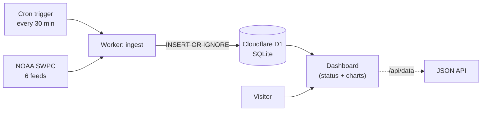

# Space Weather

An end-to-end **data pipeline + live operations console** for space weather. A scheduled job ingests **six NOAA SWPC feeds** into a database, and a dashboard renders official storm scales, a forecast, and the physical drivers behind them — the kind of console an aurora service or satellite operator actually watches.

**▶ Live: [spaceweather.dsremo.com](https://spaceweather.dsremo.com)**

## What it shows

- **Official NOAA storm scales, right now** — geomagnetic (G), radio-blackout (R), and radiation (S) levels, plus the live Kp index, solar-wind speed, IMF Bz, and current X-ray flare class.
- **NOAA 3-day geomagnetic forecast** — predicted G-level for each of the next three days.
- **Planetary Kp** — observed history with NOAA's forecast overlaid on the same chart.
- **Solar wind & IMF Bz** — speed against the north-south magnetic field (a southward Bz with fast wind is what triggers storms).
- **X-ray flare activity** — GOES flux on a log scale with C/M/X flare thresholds marked.
- **Solar-cycle context** — sunspot number and F10.7 radio flux over recent months.

## Why I built it

It's a clean, honest demonstration of a real data pipeline: pull from a live external source on a schedule, store it, and turn it into something a person can read in five seconds. The data is genuinely useful too — Kp and solar-wind speed are what aurora-chasers and satellite operators actually watch.

## How it works



A single Cloudflare Worker does both jobs: on a **cron schedule** it fetches NOAA's feeds and upserts them into **Cloudflare D1** (no duplicate rows), and on request it queries D1 and renders the dashboard. The store accumulates history beyond NOAA's short retention window, and a JSON endpoint (`/api/data`) exposes everything.

## Tech stack

Cloudflare Workers (serverless + scheduled cron) · Cloudflare D1 (SQLite) · vanilla JS + Chart.js · six NOAA SWPC public APIs (Kp + forecast, solar wind, IMF, X-ray, storm scales, solar cycle). No servers, no keys, no build step.

## Run / deploy

```bash
npm i -g wrangler
wrangler d1 create space-weather          # put the id in wrangler.toml
wrangler d1 execute space-weather --remote --file schema.sql
wrangler deploy
curl https://<your-domain>/api/ingest      # seed once; cron keeps it fresh
```

## Status

Live and ingesting on a 30-minute schedule. It's a focused demo, not a forecasting product — it reports observed conditions, it doesn't predict them.

Built by Ashutosh Tiwari · data courtesy of [NOAA SWPC](https://www.swpc.noaa.gov/).
