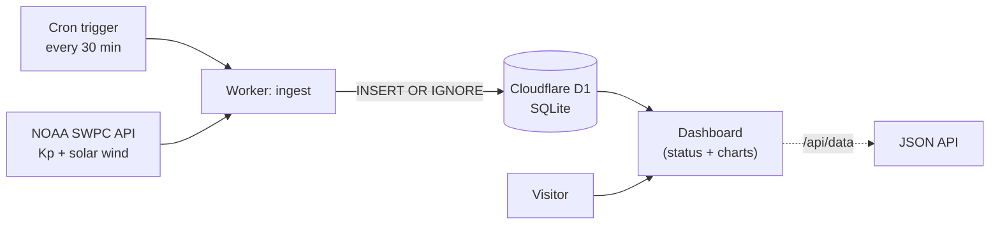

# Space Weather

A small, end-to-end **data pipeline + live dashboard** for space weather. A scheduled job pulls geomagnetic and solar-wind readings from NOAA, stores them in a database, and a dashboard charts the history and current conditions.

**▶ Live: [spaceweather.dsremo.com](https://spaceweather.dsremo.com)**

## What it shows

- **Geomagnetic activity right now** — the planetary **Kp index** (0 = calm, 9 = extreme) mapped to NOAA's storm scale (G0–G5), so you can see at a glance whether a geomagnetic storm is underway.
- **Solar wind** — current speed and proton density (faster, denser solar wind drives stronger storms and brighter auroras).
- **History charts** — Kp over the last 8 days and solar-wind speed over the last week, built from the data the pipeline has collected.

## Why I built it

It's a clean, honest demonstration of a real data pipeline: pull from a live external source on a schedule, store it, and turn it into something a person can read in five seconds. The data is genuinely useful too — Kp and solar-wind speed are what aurora-chasers and satellite operators actually watch.

## How it works



A single Cloudflare Worker does both jobs: on a **cron schedule** it fetches NOAA's feeds and upserts them into **Cloudflare D1** (no duplicate rows), and on request it queries D1 and renders the dashboard. The store accumulates history beyond NOAA's short retention window, and a JSON endpoint (`/api/data`) exposes everything.

## Tech stack

Cloudflare Workers (serverless + scheduled cron) · Cloudflare D1 (SQLite) · vanilla JS + Chart.js dashboard · NOAA SWPC public APIs. No servers, no keys, no build step.

## Run / deploy

```bash
npm i -g wrangler
wrangler d1 create space-weather          # put the id in wrangler.toml
wrangler d1 execute space-weather --remote --file schema.sql
wrangler deploy
curl https://<your-domain>/api/ingest      # seed once; cron keeps it fresh
```

## Status

Live and ingesting on a 30-minute schedule. It's a focused demo, not a forecasting product — it reports observed conditions, it doesn't predict them.

Built by Ashutosh Tiwari · data courtesy of [NOAA SWPC](https://www.swpc.noaa.gov/).
